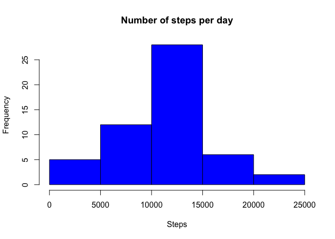
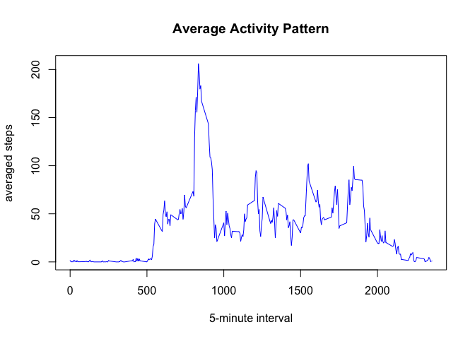
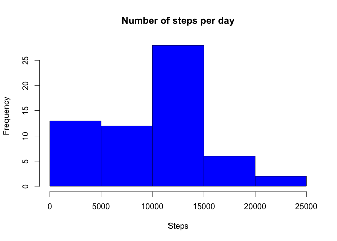
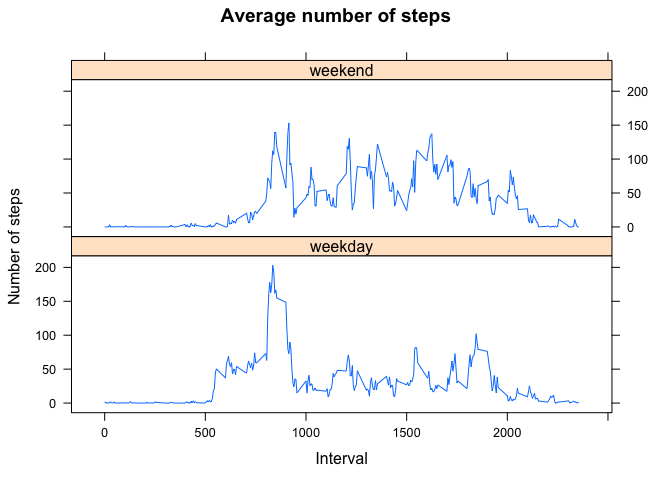

# Reproducible Research: Peer Assessment 1

## 1. Loading and preprocessing the data

```r
activities <- read.csv(unz("./activity.zip", "activity.csv"))
activitiesComplete <- activities[complete.cases(activities), ]
```

## 2. What is mean total number of steps taken per day?
- **Make a histogram of the total number of steps taken each day**

 

- **Calculate the total number of steps taken per day**


```r
meanStepsPerDay <- mean(stepsPerDay$steps)
medianStepsPerDay <- median(stepsPerDay$steps)
```

The mean is **1.0766189\times 10^{4}**  
The median is **10765**

## 3. What is the average daily activity pattern?
- **a time series plot of the 5-minute interval (x-axis) and the average number of steps taken, averaged across all days (y-axis)**

```r
stepsInterval <- aggregate(steps ~ interval, activitiesComplete, mean)
plot(stepsInterval$interval, stepsInterval$steps, type="l", xlab = "5-minute interval", ylab = "averaged steps", main = "Average Activity Pattern", col = "blue")
```

 

- **It contains the maximum number of steps on average across all the days in the dataset.**  

```r
max_interval <- stepsInterval$interval[which.max(stepsInterval$steps)]
```
The max interval is **835**

## 4. Imputing missing values
- **the total number of missing values in the dataset (i.e. the total number of rows with NAs)**

```r
miss_v <- nrow(activities[is.na(activities$steps),])
```
The number of missing values is **2304**

- **Calculate the total number of steps taken per day**

```r
activitiesComplete <- activities
activitiesComplete[is.na(activitiesComplete$steps), "steps"] <- 0
stepsPerDayComplete <- aggregate(steps ~ date, activitiesComplete, sum)
hist(stepsPerDayComplete$steps, main = "Number of steps per day", xlab = "Steps", col = "blue")
```

 

- **the mean and median of the total number of steps taken per day**

```r
meanStepsPerDayComplete <- mean(stepsPerDayComplete$steps)
medianStepsPerDayComplete <- median(stepsPerDayComplete$steps)
```
The mean is **9354.2295082**   
The median is **1.0395\times 10^{4}**  

## 5. Are there differences in activity patterns between weekdays and weekends?
- **Create a new factor variable in the dataset with two levels ??? ???weekday??? and ???weekend??? indicating whether a given date is a weekday or weekend day.**  

```r
activitiesComplete$day <- as.POSIXlt(activitiesComplete$date)$wday
activitiesComplete$dayType <- as.factor(ifelse(activitiesComplete$day == 0 | activitiesComplete$day == 6,
                                               "weekend", "weekday"))
activitiesComplete <- subset(activitiesComplete, select = -c(day))
head(activitiesComplete)
```

```
##   steps       date interval dayType
## 1     0 2012-10-01        0 weekday
## 2     0 2012-10-01        5 weekday
## 3     0 2012-10-01       10 weekday
## 4     0 2012-10-01       15 weekday
## 5     0 2012-10-01       20 weekday
## 6     0 2012-10-01       25 weekday
```

- **Make a panel plot containing a time series plot (i.e. type = "l") of the 5-minute interval (x-axis) and the average number of steps taken, averaged across all weekday days or weekend days (y-axis).**  

```r
library(lattice)
activitiesComplete <- aggregate(activitiesComplete$steps, 
                                list(interval = as.numeric(activitiesComplete$interval), 
                                     day = activitiesComplete$day),mean)
names(activitiesComplete)[3] <- "steps"

xyplot(activitiesComplete$steps ~ activitiesComplete$interval | activitiesComplete$day, 
       layout = c(1, 2), 
       type = "l", 
       xlab = "Interval", 
       ylab = "Number of steps", 
       main= "Average number of steps")
```

 

